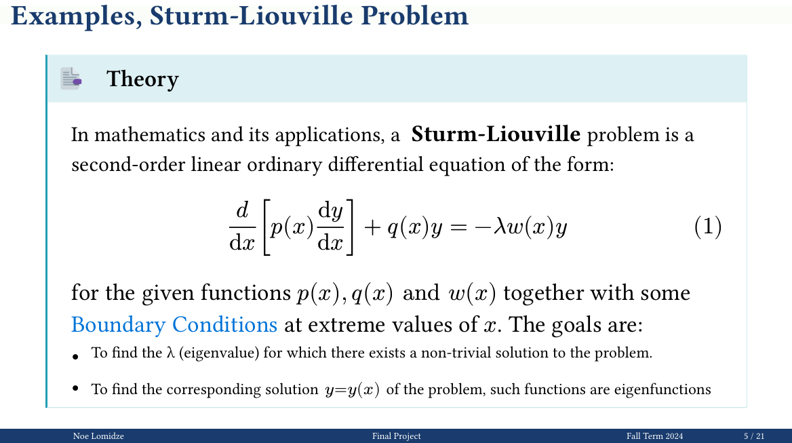

# Sturm-Liouville Problem Solver

A numerical implementation for solving Sturm-Liouville boundary value problems using the shooting method with Runge-Kutta integration.




## Overview

This project implements algorithms to find eigenvalues and eigenfunctions of Sturm-Liouville problems of the form:

```
d/dx[p(x)dy/dx] + q(x)y = -λw(x)y
```

with appropriate boundary conditions on interval [a,b].

## Features

- **Shooting Method**: Converts boundary value problems to initial value problems
- **Numerical Integration**: Implements both Euler's method and 4th-order Runge-Kutta
- **Eigenvalue Finding**: Uses bisection method to locate eigenvalues
- **Visualization**: Plots eigenvalues and eigenfunctions
- **Multiple Examples**: Includes simple harmonic oscillator, modified equations, and Legendre equation

## Examples Included

1. **Simple Case**: `y'' + λy = 0` with `y(0) = 0, y'(π) = 0`
2. **Modified Boundary**: `y'' + λy = 0` with `y(0) = 0, y(1) = 0`  
3. **Complex Example**: `y'' + 3y' + 2y + λy = 0` with `y(0) = 0, y(1) = 0`
4. **Legendre Equation**: `-(1-x²)y'' + 2xy' + λy = 0` on `[-1,1]`

## Key Methods

- **Runge-Kutta 4th Order**: High-accuracy numerical integration
- **Bisection Algorithm**: Robust eigenvalue search
- **Orthogonality Verification**: Confirms theoretical properties
- **Error Analysis**: Compares numerical vs analytical solutions


## Results

The numerical solutions demonstrate:
- Accurate eigenvalue computation (compared to analytical solutions)
- Proper orthogonality of eigenfunctions
- Convergence properties of different numerical methods
- Visualization of eigenfunction behavior

## Requirements

- Python 3.x
- NumPy
- Matplotlib
- SciPy (optional, for comparison)

## Theory

Based on classical Sturm-Liouville theory, this implementation focuses on regular problems where:
- Coefficient functions p, q, w are continuous
- p(x) > 0 and w(x) > 0 on [a,b]
- Separated boundary conditions apply

The shooting method transforms the BVP into an IVP by guessing initial conditions and using root-finding to satisfy boundary conditions.

## Author

Noe Lomidze  
Kutaisi International University  
January 2025